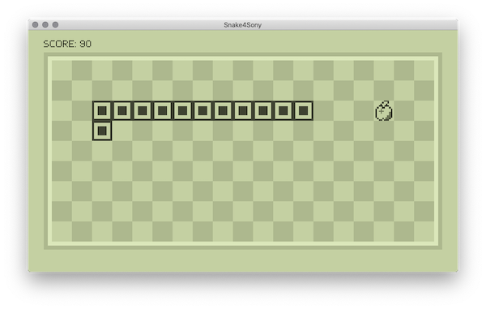
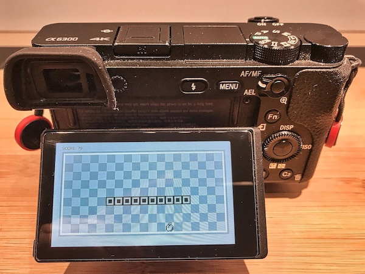
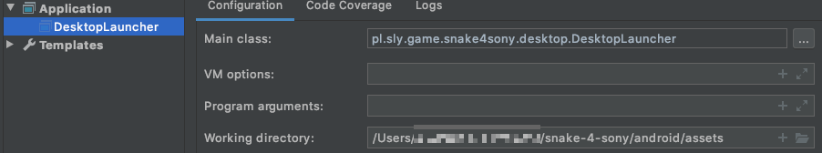

Snake-4-Sony
===============================================================

## Basically, I'm not recommending Sony products, cause crappy support and services. Think twice before you buy.

Long story short. After bought my camera `Sony Alpha A6300 (ILCE6300B)`, I realized that it contains the Android subsystem used to run apps from the `Sony PlayMemories Camera App Store`.
So I had idea to create some fancy software for it.

Project
-------
Main goal of this project was to create simple snake-like game and deploy on the Sony Alpha camera. Based on:
* libGDX framework - https://github.com/libgdx/libgdx
* Reverse engineering Sony PlayMemories Camera Apps https://github.com/ma1co/Sony-PMCA-RE

Sony Android cameras
--------------------
[link](https://github.com/ma1co/OpenMemories-Framework/blob/master/docs/Cameras.md)

Release
-------
* version `1.0`

Game input:
-----------
* `UP, DOWN, LEFT, RIGHT`
* For Android smartphone, use screen swipe
* For Sony camera use, control wheel
* For Android TV, use remote control - "item select" (arrows) 

Installation/Run
----------------
* download recent release
* Android devices:
  * via ADB
    * download and install Android SDK
    * enable ADB on the Android device
      * for enable ABD on Sony camera described below
    * open console / terminal
    * go to the location of APK apk file
    * use command for install app: `adb install snake.apk`
    * use command for run app: `adb shell monkey -p pl.sly.game.snake4sony -c android.intent.category.LAUNCHER 1`
    * use command for uninstall app: `adb shell pm uninstall pl.sly.game.snake4sony`
  * or just regular APK installation on your device
* MS Windows/macOS/Linux:
  * install JRE
  * on *nix system:`./run.sh`
  * or just `$ java -jar snake.jar`

Camera details:
---------------
* LCD: `2.95` inch
* API version: `15`
* Android version: `4.1.2`
* Android SDK version: `16`
* Android incremental version: `70`
* OpenGL version: `2`
* Screen: `854x480`
* Frame buffer: `640x480`

Tested on:
----------
* macOS Catalina `10.15.7`
* Camera: `Sony Alpha A6300` | `Android 4.1.2`
* Android TV: `Sony KDL-55W755C` | `Android 9.0`
* Smartphone: `Samsung SM-A310F` | `Android 7.0`

Issues:
-------
* on Sony camera: some issues and artifacts with rendering https://libgdx.badlogicgames.com/ci/nightlies/docs/api/com/badlogic/gdx/graphics/g2d/BitmapFont.html

Screens
--------------------------

Run
--------------------------
* On Sony Alpha Android:
  * configure WiFi connection on your camera
  * install https://github.com/ma1co/OpenMemories-Tweak on your camera to activate ADB
  * in camera menu, go to `Application list` and run `OpenMemories Tweak`
  * go to the tab: `Developer`
  * check `Enable Wifi` and `Enable ADB`
    * here receive IP address of your camera
  * on your OS go to the terminal and type: `adb connect YOUR_CAMERA_IP` 
  * deploy app via Android Studio
* On Desktop:
  * Run application from `desktop->DesktopLauncher.java` by click on `Run`
  * in case of issues configure asset folder:
  

* On Android TV
  * check IP of your Android TV
    * `IP Scanner` tool on macOS
   * enable ADB [link](https://stackoverflow.com/questions/31421872/adb-connection-to-an-androidtv)
   * on your OS go to the terminal and type: `adb connect YOUR_TV_IP`
   * deploy app via Android Studio
* On Android Device
  * deploy as regular Android application
